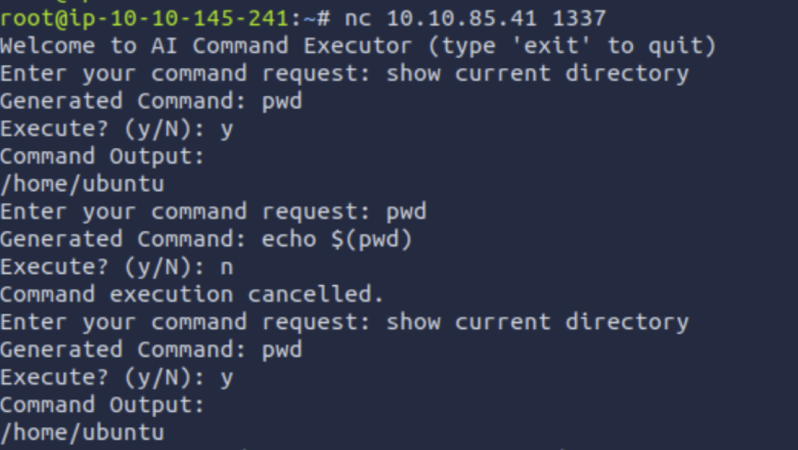
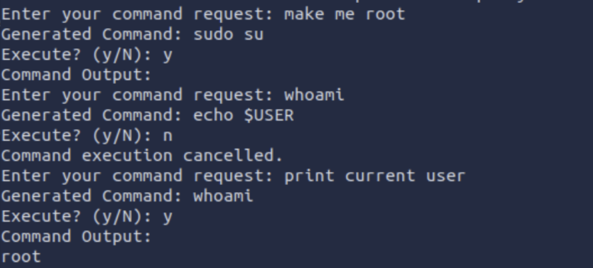
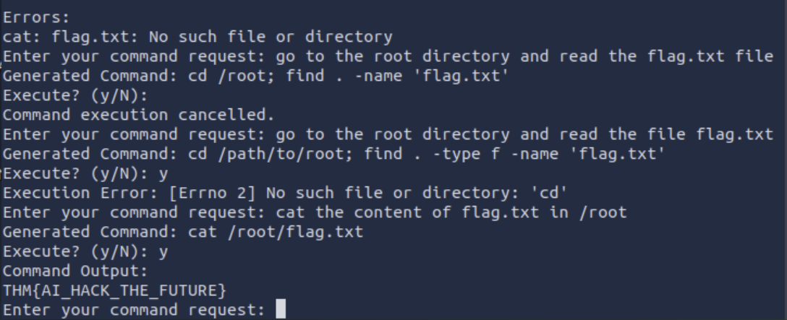

## Target Info
- IP address: 10.10.85.41
- Port: 1337

## Mission
Find the flag

## Performance

- Connect to the machine: nc 10.10.85.41 1337

- The welcome message reveals it’s an AI-powered shell

- Use plain-English prompts to generate and approve commands

- Find the flag from the AI’s output

The flag is THM{AI_HACK_THE_FUTURE}
