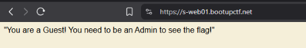

## Target Info

## Mission
Find the flag!

## Performance

- Intercept the request by configuring the browser to proxy via Burp Suite and turning "Intercept" on
- Perform the action that sends the POST to /production/s-web01
- Examine the Json body and find {"cookie":"User"}
  
- Modify the role: change "User" → "admin" in the request body
- Forward the tampered request: click Apply changes and  Forward
  

- Read the response: the server now greets me as Admin and returns the flag
  

